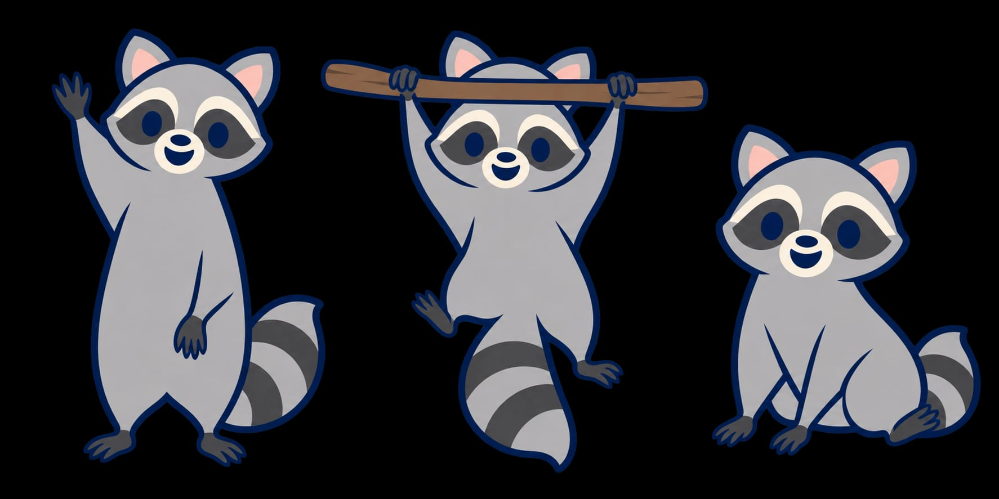

# Verbindliche Waschbärreferenzen

Festgelegt von der Nutzerin am 18. September 2026.

## Körper, Fell und Gelenke

`figurenstudie-gelenke-v1.jpeg` ist die unveränderte hochgeladene Datei „WhatsApp Image 2026-09-17 at 22.22.05.jpeg“. Sie zeigt drei Posen und dient ausdrücklich als Referenz für den Waschbären: schmaler Körper unter voluminösem, glattem Fell; stark trichterförmig zum Körper breiter werdende Vorderbeine; sehr schmale Hand- und Fußgelenke; kleine, flache, längliche Pfoten mit angedeuteten Fingern. Keine dicken Schlaucharme oder runden Plüschpfoten. Flächige Farben und klare dunkelblaue Konturen beibehalten.

Die bereits vorhandene `../waschbaer-koerperstudie-v1.png` und die Einzelposen bleiben erhalten. Diese zusätzliche Dreiposen-Datei hält die konkret im Gespräch bezeichnete Referenz unverändert fest.

## Frühere Arbeitsfassung – nicht die aktuelle Referenz

`seitlicher-kopf-szenenreferenz-v1.png` ist das zuletzt gemeinsam bearbeitete Szenenbild, erzeugt am 18. September 2026 (Quelldatei `exec-d07d1f02-ef0a-45b8-b7ef-986f6eb19683.png`). Die Nutzerin hat den Kopf dieses Bildes als Referenz für die seitlich gedrehte Dreiviertelansicht bestimmt: zusammenhängende Perspektive von Kopf, Maske, Augen, Schnauze und einer Nase sowie freundlicher, dem Mädchen zugewandter Ausdruck. Es ist keine reine Profilansicht.

Die vollständige Szene wird zur eindeutigen Identifikation erhalten. Die Referenzfreigabe gilt für den Kopf, nicht pauschal für Körper, Pfoten, Schulteranatomie oder die gesamte Illustration. Insbesondere ersetzt diese Szene nicht die Gelenk- und Fellreferenz oben.

## Anwendung und Herkunft

Bei künftigen Bildbearbeitungen beide Referenzrollen ausdrücklich unterscheiden und die jeweils benötigten Bilder tatsächlich als Eingaben verwenden. Ergebnis visuell gegen die Referenzen prüfen; ein formulierter Auftrag ist kein Nachweis einer gelungenen Umsetzung.

Die Szenenreferenz entstand mit KI-Bildbearbeitung. Die Figurenstudie wurde von der Nutzerin als Projektvorlage bereitgestellt; aus dem WhatsApp-Dateinamen wird keine Urheberschaft abgeleitet. Diese Ablage dokumentiert die gestalterische Referenzwahl, keine zusätzliche Aussage über ausschließliche Rechte.

Keine der beiden Dateien wird durch diese Ablage in die sichtbare Website eingebunden. Bestehende Bildoriginale bleiben unverändert.

## Bekannte Fehler dieser Szenenfassung

Nach Hinweis der Nutzerin: Hinter dem Kopf am Mützenrand liegt eine zusätzliche graue Spitze, die wie ein drittes Ohr wirkt. Diese Form ist ausdrücklich kein Bestandteil der Kopfreferenz; künftige Figuren haben genau zwei anatomisch zusammengehörende Ohren. Die Freigabe bezieht sich auf Gesicht und perspektivische Ausrichtung.

Die Pfote wurde verlängert, die Schulter- und obere Vorderbeinpartie des Waschbären bleibt aber zu rund. Die gewünschte trichterförmige Fellkontur über dem schmalen Körper muss am gesamten Übergang von Rumpf und Schulter zum schmalen Gelenk umgesetzt werden, nicht nur an der Pfote. Dies bleibt eine offene Korrektur; die Szenenfassung ist keine vollständige Anatomievorlage.

## Aktuell freigegebene Kopf- und Websitefassung

Die Nutzerin hat nach weiteren Korrekturen die zuletzt gezeigte Fassung ausdrücklich zur Übernahme in Git und Website freigegeben. `seitlicher-kopf-szenenreferenz-v2.png` (Quelle: `exec-0e24ee06-4d54-41af-9cd4-05fcf80caa9f.png`) ersetzt v1 als aktuelle Kopfreferenz. Kopfneigung, Gesicht und beide Ohren sind als zusammenhängende Form zu behandeln. Die kleine graue Spitze wurde im Verlauf ausdrücklich gewünscht und darf nicht pauschal als unerwünschtes drittes Ohr entfernt werden.

Die ältere Fehlerbeschreibung oben betrifft v1 und ist Entwicklungshistorie. Die Kopfkontur von v2 ist eine akzeptierte Annäherung, keine exakte Kopie der Ohrvorlage. Die Figurenstudie bleibt die maßgebliche Körper- und Gelenkreferenz. Die vollständige Szene v2 ist zusätzlich als Website-Leitbild freigegeben und verlustfrei als `../../assets/wenn-ich-gross-bin-waschbaer-v4.webp` eingebunden. Originale bleiben erhalten.
